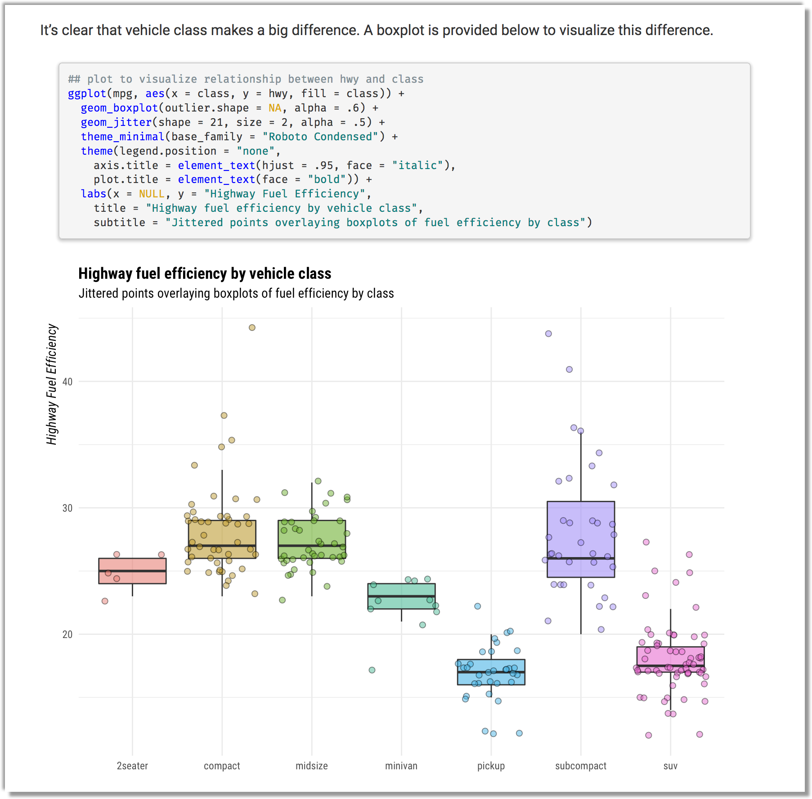
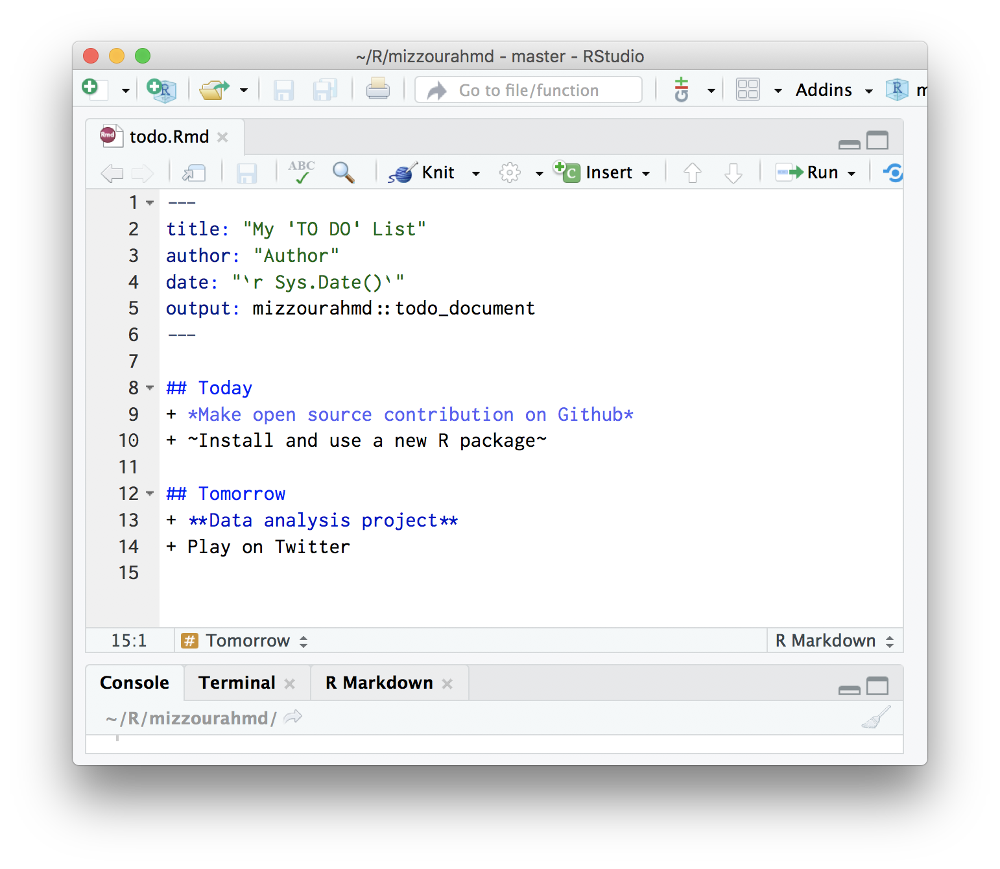
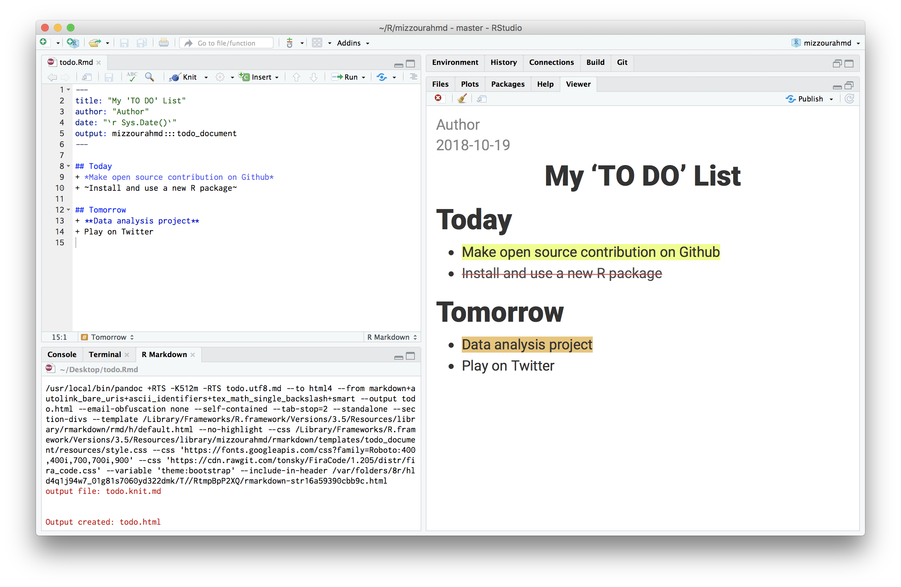

<!-- README.md is generated from README.Rmd. Please edit that file -->

```{r setup, include = FALSE}
knitr::opts_chunk$set(collapse = TRUE, comment = "#>")
```
# mizzourahmd 

[](https://www.tidyverse.org/lifecycle/#experimental)

> 🐯 A clean and pretty rmarkdown template (I don't like any of the default themes). 😎

## Installation

You can install the released version of mizzourahmd Github with:

``` r
## install from github
remotes::install_github("mkearney/mizzourahmd")
```

## Example

Additional information about and screen shots of the rendered 
[default template](inst/rmarkdown/templates/mizzou_document/skeleton/skeleton.Rmd) 
are included below.

### Fonts

This template uses [Roboto Condensed](https://fonts.google.com/specimen/Roboto+Condensed) 
for its default font, [Roboto Black](https://fonts.google.com/specimen/Roboto) for its headings, and [Fira Code](https://github.com/tonsky/FiraCode) (with ligatures)
for all code.

<p align="center">
  
</p>

### Data frames

By default, the template renders data frames using **{knitr}**'s `"kable"`,
which results in a nice looking HTML table.

<p align="center">
  
</p>

### Figures

And plots render nicely as well!

<p align="center">
  
</p>

## TO DO lists

Create nice-looking TO-DO lists with the `mizzourahmd::todo_document` template

<p align="center">
  
</p>


The default template renders HTML that looks like this:


<p align="center">
  
</p>


