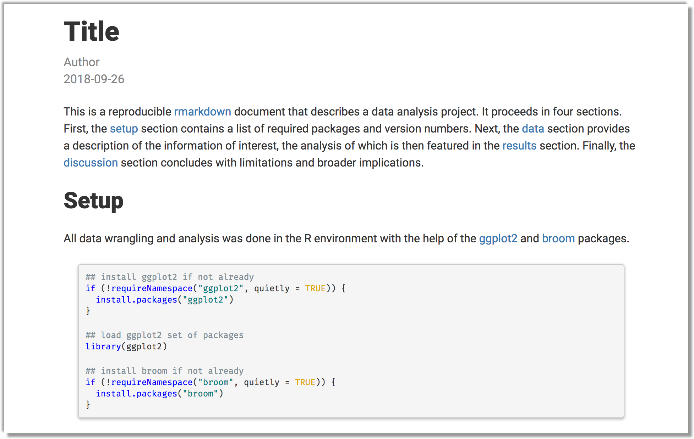
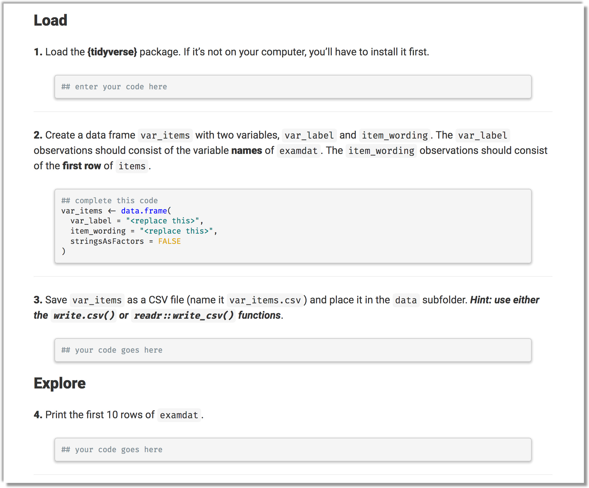

<!-- README.md is generated from README.Rmd. Please edit that file -->

```{r setup, include = FALSE}
knitr::opts_chunk$set(
  collapse = TRUE,
  comment = "#>",
  fig.path = "man/figures/README-",
  out.width = "100%"
)
```
# mizzourahmd

The goal of mizzourahmd is to provide a clean and pretty rmarkdown template (I 
don't like any of the default themes).

## Installation

You can install the released version of mizzourahmd Github with:

``` r
## install from github
remotes::install_github("mkearney/mizzourahmd")
```

## Example

Here are a couple screen shots of the output:

<p style="align:center"></img></p>


<p style="align:center"></img></p>
